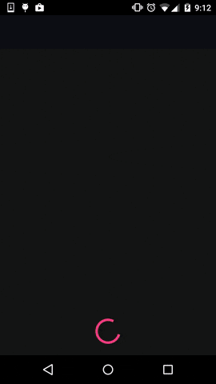

Drive
==========================
Simple Dribbble client for Android to showcase how to use [Cappuchino][1] UI test library.

About this app
===
##Architecture
We follow the MVP pattern to make this app easy to test.  
Our MVP approach is based on [googlecodelabs/android-testing][2].

##Unit tests
We used **JUnit4** and **Mockito** for unit tests.

##UI Tests
We used **Cappuchino** and **Dagger2** for UI tests.  

- *Cappuchino* makes our test code short and easy to read.
- *Dagger2* is used for mocking server responce.

UI tests written in Cappichino is [here][3].

License
-------

    Copyright 2015 Kota Ishimoto

    Licensed under the Apache License, Version 2.0 (the "License");
    you may not use this file except in compliance with the License.
    You may obtain a copy of the License at

       http://www.apache.org/licenses/LICENSE-2.0

    Unless required by applicable law or agreed to in writing, software
    distributed under the License is distributed on an "AS IS" BASIS,
    WITHOUT WARRANTIES OR CONDITIONS OF ANY KIND, either express or implied.
    See the License for the specific language governing permissions and
    limitations under the License.
           
[1]: http://github.com/ishikota/Cappuchino
[2]: http://www.code-labs.io/codelabs/android-testing/#3
[3]: http://github.com/ishikota/Drive/tree/master/app/src/androidTest/java/jp/ikota/drive/ui
